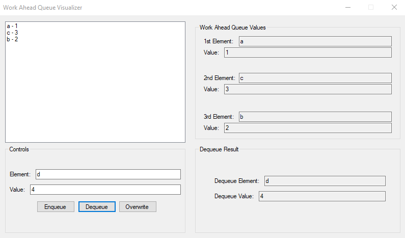

# WorkAheadQueueVisualizer
A program to visualize how WorkAheadQueue's work (An assignment for the class ITSC 2214 at UNC Charlotte)



# How it works:
A WorkAheadQueue lets you access and utilize the first three nodes and elements at any given time, it is an enhanced queue per say.

# How to use the program
```
Enqueue (Add):
- Enter in an element name
- Enter in a value for that element
- Press the "Enqueue" button to add the element

Note: After an element is added the first time, you will have to select an area to enqueue the next object
```
```
Dequeue (Remove):
- Select an element from the queue
- Press the "Dequeue" buttom to remove the element
- Observe the element and value that is dequeued at the bottom right area
```
```
Overwrite (Modify):
- Select an element from the queue
- Enter in a new element name
- Enter in a new element value
- Press the "Overwrite" button to change the elements' contents
```
